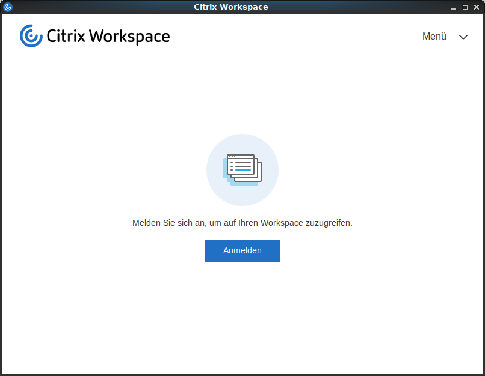

<!-- Required extensions: pymdownx.betterem, pymdownx.tilde, pymdownx.emoji, pymdownx.tasklist, pymdownx.superfences -->

# Home Office via Citrix Workspace App on Raspian Buster

The Raspberry Pi 4 single board computer supports dual screen configurations and
thus has become a silent, serious candidate for Home Office work.

I am using a Raspberry Pi 4 4GB, with Raspian Buster, 2x screen with an USB speakerphone.
The assumption is that Raspian is installed with the LXDE-pi desktop and that the displays are working. 

## What you will find in this HowTo
* Configuration of Raspian to be able to use a dual screen setup with the Citrix Workspace App.
* Setup echo cancellation with Pulseaudio to be able to make Teams / Skype4Business via Citrix Workspace.

### Positives and Negatives
* The Citrix Workspace App  
  :heavy_plus_sign: can be downloaded as armhf Debian package for Buster on the Citrix website  
  :heavy_plus_sign: comes with it's own outdated certificate store, that most likely requires an update  
  :heavy_plus_sign: the memory usage is low enough that even the 1GB model should suffice  
  :heavy_minus_sign: requires a different window manager than openbox due to missing multi-monitor hints  
  :heavy_minus_sign: no optimization for realtime audio (Skype calls, etc.)  
* Raspian Desktop  
  :heavy_plus_sign: the LXDE-pi desktop is sleek and nicely customized  
  :heavy_minus_sign: the lightweight LXDE desktop does fullfill all assumptions expected by "business" apps  
  :heavy_minus_sign: from my personal experience the Alsa soundsystem is not nearly as usable as Pulseaudio for an enduser  
  :heavy_minus_sign: Raspian Desktop starts to slow down after a few hours of use and the Xorg process shows almost 100% CPU.
  Logging out and in again workarounds this problem.  
  I discoverd that this does not happen if gpu_mem is bumped to 320MB and 4k60Hz mode is activated
  in /boot/config.txt:
  ```ini
  hdmi_enable_4kp60=1
  gpu_mem=320
  ```

## Installation
The Citrix Workspace App can be downloaded via the Citrix homepage.

[Citrix Workspace app for Linux (ARM HF)](https://www.citrix.com/downloads/workspace-app/linux/workspace-app-for-linux-latest.html)

Navigate to _Available Downloads_ :arrow_forward: _Debian Packages_ :arrow_forward: _Full Packages_ and click **Download file**

Since version Dec 12, 2019 the package can be directly installed via gdebi package manager. All required packages will automatically be downloaded.
To install open the _Downloads_ folder in the file manager, right-click on the icaclient*.deb package and install the package.

You now can launch Citrix Workspace via _Menu_ :arrow_forward: _Internet_ :arrow_forward: _Citrix Workspace_

### SSL Connection Problems
Should you be unable to connect, and get a `SSL connection could not be established` error then it is highly likely that this is due
to missing certificate autority (ca) certificates delivered with the Citrix Workspace App.
In order to make Citrix Workspace use the ca cert's of Raspian:
```sh
sudo ln -s /etc/ssl/certs/*.pem /opt/Citrix/ICAClient/keystore/cacerts/
```
Now you should be able to connect.

### Notable User Settings in wfclient.ini
In the user settings folder of the Citrix Workspace App (former ICAClient) is wfclient.ini where several adjustments can be made.  
[Citrix Workspace App for Linux Product Documentation](https://docs.citrix.com/en-us/citrix-workspace-app-for-linux/configure-xenapp.html)  
[Citrix Workspace App for Linux OEM Reference Guide](https://developer-docs.citrix.com/projects/workspace-app-for-linux-oem-guide/en/latest/reference-information/)

To edit
```sh
cd ~/.ICAClient
nano wfclient.ini
```

#### Force a switch of the Keyboard Layout
I had to change `KeyboardLayout=(User Profile)` to `KeyboardLayout=German` to get a german keyboard layout, the automatic detection did not work on Raspian, maybe some dependency is missing.

#### Set medium audio quality
I found that for using online meetings via Skype4Business tunneled through the SSL connection setting medium audio quality works best for me.
To set medium audio quality on the client add a line with `AudioBandwithLimit=1` to the `[WFClient]` section.

## Dual-Screen Fullscreen
Citrix Workspace supports fullscreen over dual screens layouts and so does the Raspberry Pi. Unfortunately the default window manager _Openbox_ lacks the correct hints for the Citrix Workpace App. The only way around it is to us a different windowmanager.  
[Citrix Workspace Linux App on Raspbian (Raspberry Pi 4 B with two Monitors) does not do Fullscreen over two monitors](https://discussions.citrix.com/topic/405984-solved-citrix-workspace-linux-app-on-raspbian-raspberry-pi-4-b-with-two-monitors-does-not-do-fullscreen-over-two-monitors/?do=findComment&comment=2054524)

I didn't use the icwm window manager, but went for Marco, the window manager of the Mate desktop environment. So if you have installed Mate, instead of LXDE, everything is fine.
Marco does not require one gazillion of additional libraries, is still relatively light weight and can be configured via command line. [Marco, MATE default window manager](https://github.com/mate-desktop/marco)

### Installation

Install the packages via apt
```sh
sudo apt install marco mate-themes
```

In order for mate to be used, the window manager of the LXDE-pi desktop has to be changed.

This can either be accomplished for all users or just for a single user by changing the window manger in `desktop.conf`.

For a global configuration, edit the file:
```sh
sudo nano /etc/xdg/lxsession/LXDE-pi/desktop.conf
```

For a configuration for the current user only, copy `desktop.conf` to your user directory and change the window manager.
```sh
cp /etc/xdg/lxsession/LXDE-pi/desktop.conf ~/.config/lxsession/LXDE-pi/
nano ~/.config/lxsession/LXDE-pi/desktop.conf
```

Change 
```
window_manager=openbox-lxde-pi
```
to
```
#window_manager=openbox-lxde-pi
window_manager=marco
```

If you log out of your X11 session an login again, the desktop will no longer use openbox as window manager, but marco instead.

### Configure marco
I configured marco to use a single workspace (the default is 4), the Blue-Submarine theme because it is a good fit for Raspian colors and sloppy window focus mode. Sloppy means that an open window will get the focus once you hover the mouse over it.
```sh
gsettings set org.mate.Marco.general num-workspaces 1
gsettings set org.mate.Marco.general theme Blue-Submarine
gsettings set org.mate.Marco.general focus-mode sloppy
```

Once you have done that Citrix Workspace will look like


